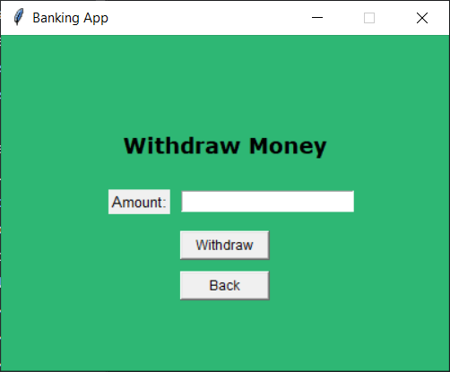

# Fejezetek
- [Áttekintés](#1-áttekintés)
- [Jelenlegi helyzet](#2-jelenlegi-helyzet)
- [Követelménylista](#3-követelménylista)
- [Jelenlegi üzleti folyamatok](#4-jelenlegi-üzleti-folyamatok-modellje)
- [Igényelt üzleti folyamatok](#5-igényelt-üzleti-folyamatok-modellje)
- [Használati esetek](#6-használati-esetek)
- [Megfeleltetés](#7-megfeleltetés)
- [Képernyőtervek](#8-képernyőtervek)
- [Forgatókönyv](#9-forgatókönyv)
- [Funkció](#10-funkció)

# 1. Áttekintés

Az IO Bankcsoport célja, hogy egy modern, felhasználóbarát és biztonságos banki applikációt fejlesszen, amely megkönnyíti ügyfeleink számára a bankszámlák kezelését és a pénzügyi tranzakciók lebonyolítását.

Az applikáció elsődleges funkciója, hogy a felhasználók számára kényelmes és hatékony megoldást biztosítson a számlaegyenleg megtekintésére, valamint a pénzfeltöltés és pénzfelvétel lebonyolítására.

Az alkalmazás használatát minden, a bankunkhoz tartozó számlával rendelkező ügyfél számára elérhetővé tesszük, függetlenül attól, hogy milyen platformot használnak – legyen szó asztali számítógépről, laptopról vagy mobil eszközről.

A rendszer tervezésénél nagy hangsúlyt fektetünk a platformfüggetlenségre, hogy ügyfeleink bárhonnan és bármilyen eszközről elérhessék bankszámláikat, ezzel is növelve az applikáció használhatóságát és elérhetőségét.

Az applikáció lehetőséget biztosít a felhasználók számára, hogy valós időben nyomon követhessék számlaegyenlegüket, és zökkenőmentesen végezhessenek tranzakciókat, például pénzt tölthetnek fel számlájukra vagy vehetnek le arról.

A rendszer emellett magas fokú biztonságot kínál, garantálva, hogy a felhasználók személyes és pénzügyi adatai védve legyenek a legújabb adatvédelmi és IT biztonsági szabványoknak megfelelően.

A felhasználói élmény optimalizálása érdekében az alkalmazás intuitív és egyszerűen használható felületet biztosít, amely lehetővé teszi, hogy az ügyfelek gyorsan és könnyedén végezhessenek pénzügyi tranzakciókat.

Az IO Bankcsoport számára kiemelten fontos, hogy ügyfelei teljeskörű szolgáltatásokat vehessenek igénybe online felületen is, minimalizálva az ügyfélszolgálati irodákban történő személyes megjelenés szükségességét.

Az applikáció bevezetésével az IO Bankcsoport célja, hogy még versenyképesebb és ügyfélközpontúbb szolgáltatást nyújtson, miközben megőrzi a bankunk által kínált biztonságot és megbízhatóságot.

Az új digitális platform segít abban, hogy az ügyfeleink bármikor és bárhonnan képesek legyenek pénzügyeik hatékony kezelésére, növelve ezzel pénzügyi szabadságukat és kényelmüket.

# 2. Jelenlegi helyzet

Az OI bankcsoport egy feltörekvő vállalkozás ami versenyképes kamatokat és nagy fokú biztonságot kínál ügyfelei számára.

Viszont bankunknak jelenleg nincs megfelelő applikációja ügyintézések lebonyolitására.

Ez nagyban megnehezíti az ügyfelek számára az ügyintézést, hiszen jelenleg füzetben és papíron tarjuk nyilván az ügyfelek banki adatait. Ez a helyzet trathatatlan.

Ennek érdekében készítünk jelenleg egy applikációt, aminek segítségével a bankunkhoz tartozó ügyfelek online is lebonyolíthatják fontosabb ügyeiket.

Ide tartozik a számlán lévő pénzlekérdezés, a pénzfeltöltés illetve pénzfelvétel.
        
# 3. Követelménylista

   |   Modul   |   ID  |   Név |   version |   Kifejtés    |
   |:----------|:------|:------|:----------|:--------------|
   |    Jogosultság |   1   |   Regisztráció    |   1.0 | Felhasználói fiók létrehozása  |
   |    Adatkezelés |   2   |   Adat mentése    |   1.0 |   Regisztrált adatok mentése adatbázisba |
   |   Jogosultság |   3  |    Bejelentkezés   |   1.0 |   A felhasználó a felhasználói nevével illetve PIN kód párossal bejelentkezhet. Ha a felhasználónév illetve a PIN kód páros nem megfelelő, hibaüzenetet kap. |
   |   Felület |   4   |   Balance Check   |   1.0 |   A felhasználó megnézheti a számláján való összeget.|
   |   Jogosultság |   5   |   Pénz Deposit   |   1.0 |   A felhasználó pénzt tölthet fel a számlájára.   |
   |   Jogosultság    |   6   |   Pénz Withdraw   |   1.0 |   A felhasználó pénzt vehet fel.    |

# 4. Jelenlegi üzleti folyamatok modellje
   -  3.1. Új ugyfél Felvétele a rendszerbe: banki ugyintéző végzi => füzetbe való bejegyzése
   -  3.2 Számla nyitás banki ugyintéző végzi => füzetbe való bejegyzése, a kézpénz széfben tárolása a főigazgató hálósoábályában a festmény mögött a kód 1111
   -  3.3 Ügyfelek a számlájukon lévő összeget lekérdezése.
   -  3.4  Új számla vagy megtakításos számla igénylése -> csak személyesen, papír alapú regisztrálás
# 5. Igényelt üzleti folyamatok modellje
-    4.1. Igényelt funkciók
-    4.1.1. Új számla igénylése után: Regisztráció
-    4.1.2. Ügyfél adatainak elmentése: felhasználónév, PIN kód
-    4.1.3. Applikáción keresztüli pénzlekérdezés
-    4.1.4. Applikációs pénzfelvétel
-    4.1.5. Applikációs pénzfeltöltés 
# 6. Használati esetek
Világszerte bármely bankcsoport hasznára lehet felhasználók nyílvántartására és tranzakciók lebonyolítására. 
Az ügyfelek számára magas fokú kényelmet biztosít hiszen bárhonnan intézhetik banki ügyeiket. 
Ide tartozik a pénz feltöltés, pénz felvétel valamint számlájukon lévő összeg lekérdezése.
      
# 7. Megfeleltetés

Az alkalmazás használatához a felhasználónak először egy fiókot kell regisztrálnia, amelyhez feltétel, hogy rendelkezzen a bankunkhoz tartozó bankszámlával.

A regisztráció során a felhasználó megadja személyes adatait, például a nevét és egy általa választott PIN kódot, amelyet a rendszer a biztonsági előírásoknak megfelelően tárol és kezel.

A regisztráció befejezése után a felhasználó hozzáférhet az applikáció teljes funkcionalitásához.

A sikeres regisztrációt követően a felhasználó az általa megadott felhasználónév és PIN kód kombinációjával léphet be a rendszerbe. A belépési folyamat során a rendszer ellenőrzi a megadott adatokat, és ha azok helyesek, a felhasználó számára megnyílik az applikáció fő menüje. 
- Ebben a menüben a felhasználó több lehetőség közül választhat:
   - lekérdezheti a bankszámláján aktuálisan rendelkezésre álló összeget
   - pénzt tölthet fel a számlájára
   - pénzt vehet le számlájáról

A rendszer úgy lett kialakítva, hogy a felhasználók számára egyszerű és intuitív felhasználói élményt biztosítson. A tranzakciók biztonságosak és gyorsan végrehajthatók, így a felhasználó bármikor hozzáférhet a számlájához, és könnyedén menedzselheti pénzügyeit. A felhasználó továbbá értesítést kaphat a sikeres tranzakciókról és a számlaegyenleg változásairól, így mindig naprakész információkkal rendelkezik.

Az applikáció lehetővé teszi, hogy a felhasználók bárhonnan, akár mobiltelefonjukon keresztül is hozzáférjenek a számlájukhoz, ezáltal növelve pénzügyeik kezelhetőségének kényelmét és rugalmasságát. Ezzel a rendszer megfelel a modern pénzügyi szolgáltatásokkal szemben támasztott igényeknek, hiszen azonnali hozzáférést biztosít a legfontosabb banki funkciókhoz.

# 8. Képernyőtervek

# 9. Forgatókönyv

A felhasználó a bankszámlanyitási folyamat során vagy annak lezárását követően egyből regisztrálhat az applikációban. A regisztrációt követően, amint a felhasználó belép a rendszerbe a megadott felhasználónév és PIN kód kombinációjával, az applikáció hozzáférést biztosít a felhasználó saját bankszámlaadataihoz. Ezek között megtalálhatók a legfontosabb információk, például a számlaszám és a számlán aktuálisan rendelkezésre álló pénzösszeg.

A felhasználói felület úgy lett kialakítva, hogy könnyedén átlátható és kezelhető legyen, még azok számára is, akik nem rendelkeznek magas szintű technikai tudással. A számla adatait tartalmazó főoldalról a felhasználó egyetlen kattintással hozzáférhet a különböző tranzakciós lehetőségekhez, mint például a pénzátutalás vagy pénzfelvétel.

A tranzakciók végrehajtásához az alkalmazás automatikusan generál egy egyedi tranzakciós kódot, amely biztosítja a pénzügyi műveletek biztonságát. Ez a kód minden egyes tranzakcióhoz külön-külön kerül létrehozásra, így megakadályozva a visszaéléseket és növelve az applikáció használatának biztonságát.

Az applikáció lehetővé teszi, hogy a felhasználó egyszerűen és gyorsan végezze el a pénzfelvételt vagy az átutalást, továbbá nyomon követhesse ezek állapotát. A felhasználó a tranzakciók befejezését követően azonnali értesítést kap az applikációban, amely megerősíti a sikeres műveletet, valamint frissíti a számla egyenlegét, hogy az mindig naprakész legyen. Mindez hozzájárul ahhoz, hogy a felhasználó a lehető legkényelmesebben és biztonságosabban intézhesse pénzügyeit.

    

# 10. Funkció

Az alábbi funkciók kerülnek megvalósításra a banki applikációban, amelyek az ügyfelek számára egyszerű és biztonságos hozzáférést biztosítanak pénzügyeik kezeléséhez.

- **Új fiók létrehozása**: Az applikáció lehetővé teszi, hogy a felhasználók új fiókot hozzanak létre a rendszerben. A regisztráció során a felhasználói adatokat (felhasználónév, PIN kód) adatbázisba menti a rendszer, így az adatok megőrződnek a program futtatásai között. Az adatok biztonságos tárolása elsődleges prioritás.

- **PIN kód kezelése**: A fiók létrehozásakor a program ellenőrzi, hogy a PIN kód csakis 4 számjegyből álljon. A PIN kód beírása során a karakterek csillag (*) jel mögé rejtődnek, ezzel is biztosítva a titkosságot. Ez a megoldás növeli a felhasználó biztonságérzetét.

- **Automatikus bejelentkezés**: A fiók sikeres létrehozása után az applikáció automatikusan bejelentkezteti a felhasználót, majd megjeleníti a főmenüt, ahonnan további funkciókat érhet el.

- **Pénzfelvétel**: Az applikáció lehetőséget biztosít pénz felvételére. A felhasználónak meg kell adnia az összeget, amelyet fel szeretne venni. Ha az összeg nagyobb, mint a számlán lévő egyenleg, figyelmezteti a felhasználót. Ha az összeg megfelelő, akkor azt levonja a számláról, és a tranzakció megtörténik.

- **Pénzfeltöltés**: Az applikáció lehetőséget biztosít pénz feltöltésére is. A felhasználónak meg kell adnia az összeget, amit hozzá szeretne adni a számlájához. Az applikáció ezt az összeget hozzáadja a jelenlegi egyenleghez, és frissíti az adatokat.

- **Összeg lekérdezése**: A felhasználó bármikor megtekintheti az aktuális egyenlegét a "Balance Check" funkció segítségével. Az applikáció megjeleníti a számlán lévő pontos összeget.

- **Kijelentkezés**: A felhasználónak lehetősége van kijelentkezni a rendszerből, amely visszaviszi őt a kezdőmenübe. Innen új fiókot hozhat létre, vagy bejelentkezhet egy másik fiókba. A kijelentkezési funkció biztosítja, hogy a felhasználói adatok védelme érdekében a munkamenet biztonságosan lezáruljon.
