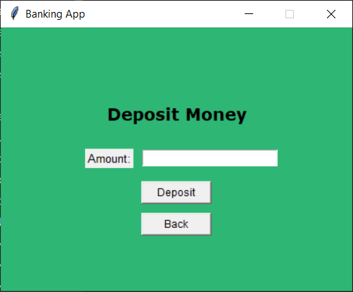

# Fejezetek
- [Rendszer célja](#1-rendszer-célja)
- [Projektterv](#2-projektterv)
- [Üzleti folyamatok modellje](#3-üzleti-folyamatok-modellje)
- [Követelmények](#4-követelmények)
- [Funkcionális terv](#5-funkcionális-terv)
- [Fizikai környezet](#6-fizikai-környezet)
- [Architekturális terv](#7-architekturális-terv)
- [Implementációs terv](#8-implementációs-terv)
- [Tesztterv](#9-tesztterv)
- [Telepítési terv](#10-telepítési-terv)
- [Karbantartási terv](#11-karbantartási-terv)

# 1. Rendszer célja
- A banki applikáció célja egy egyszerű, Python nyelven fejlesztett asztali alkalmazás biztosítása. 
- Az alkalmazás lehetővé teszi a felhasználók számára bankszámlájuk hatékony kezelését. 
- A rendszer alapvető funkciói közé tartozik a felhasználói regisztráció, belépés, egyenleglekérdezés. 
- A felhasználók pénzfelvételt (withdraw) és pénzbefizetést (deposit) is végezhetnek az applikációban. 
- A regisztráció során meg kell adni a felhasználó nevét, PIN kódját és az alap egyenleget. 
- A felhasználói adatok adatbázisban kerülnek tárolásra, biztosítva a biztonságos és hatékony hozzáférést. 
- Ez a megoldás megkönnyíti az adatkezelést és egy egyszerű fájlstruktúrát biztosít. 
- A cél az, hogy a felhasználók könnyen hozzáférhessenek pénzügyi információikhoz. 
- Ezen kívül biztonságosan tudják kezelni számlájukat a rendszer segítségével. 
- A rendszer célja, hogy felhasználóbarát élményt nyújtson a banki tranzakciók lebonyolításában és lehetővé tegye a pénzügyi tudatosság növelését azáltal, hogy a felhasználók könnyen nyomon követhetik kiadásaikat és megtakarításaikat. 
- A rendszer megkönnyíti a felhasználók napi pénzügyi tranzakcióit, ezáltal növelve a pénzügyi tudatosságukat.
- Az applikáció jövőbeli bővítése lehetővé teszi további funkciók, például a költségvetési tervezés és a pénzügyi elemzés beépítését.

# 2. Projektterv
- A projekt során egy asztali alkalmazást fejlesztünk Python nyelven. 
- Az alkalmazás minimális külső függőségekkel rendelkezik. 
- A fejlesztés három fő fázisra oszlik: tervezés, implementáció és tesztelés. 
- A tervezési szakasz során a felhasználói igények azonosítása a cél. 
- Az implementáció során a funkciók valódi megvalósítása történik. 
- A tesztelés során biztosítjuk, hogy a rendszer megfelelően működjön. 
- A fejlesztési folyamatot agilis szemlélettel kezeljük. 
- Rövid iterációkban dolgozunk, hogy rugalmasan alkalmazkodjunk az igényekhez. 
- Az adatok kezelése adatbázisban történik, amely lehetővé teszi a hatékony regisztrációt és a felhasználói adatkezelést. 
- Ez lehetővé teszi az egyszerű regisztrációt és a felhasználói adatkezelést. 
- A projekt tervezett időtartama 3 hét, figyelembe véve az időlimitációkat. 
- Folyamatosan teszteljük és fejlesztjük a funkciókat a projekt során. 
- A projekt során külön figyelmet fordítunk a felhasználói visszajelzések beépítésére, hogy az alkalmazás folyamatosan fejlődhessen és alkalmazkodjon a felhasználói igényekhez.
- A tervezési fázis során a piackutatás is szerepet kap, hogy jobban megértsük a felhasználói igényeket.

**Projektmunkások és feladatkörök**:
1. **Backend munkálatok**:
    - Fink József
    - Szűcs Ferenc
    - Veress József
2. **GUI megvalósítása**: 
    - Fink József
3. **Specifikációk megírása**:
    - Veress József
4. **Egyszégtesztek megírása**:
    - Szűcs Ferenc
5. **Adatok megfelelő tárolása**:
    - Fink József
    - Szűcs Ferenc
    - Veress József
6. **Specifikációk bővítése**:
    - Fink József
    - Szűcs Ferenc
7. **GUI szépítése**:
    - Veress József
    - Szűcs Ferenc
8. **Osztályok megírása**:
    - Fink József
    - Veress József

# 3. Üzleti folyamatok modellje
Az alkalmazás fő üzleti folyamatai a következők:
1. **Felhasználói regisztráció**:
    - A felhasználó megadja a szükséges adatokat.
    - A szükséges adatok közé tartozik a név, e-mail cím, és PIN kód.
    - Ezek az adatok adatbázisban kerülnek mentésre.
2. **Bejelentkezés**:
    - A felhasználó a regisztrált e-mail címével és jelszavával tud belépni.
    - A rendszer az adatbázisban tárolt adatokat ellenőrzi a bejelentkezés során.
3. **Egyenleg lekérdezés**:
    - A felhasználó lekérheti a számlaegyenlegét.
    - Ez az egyenleg egy egyszerű számként van tárolva, és frissül a tranzakciók során.
4. **Pénzfelvétel (Withdraw)**:
    - A felhasználó megad egy összeget.
    - Ezt az összeget le szeretné venni a számlájáról.
    - Ha elegendő egyenlege van, az összeg levonásra kerül a számláról.
5. **Pénzbefizetés (Deposit)**:
    - A felhasználó megadhat egy összeget, amelyet szeretne befizetni.
    - Ez az összeg növeli a számla egyenlegét a tranzakció során.
6. **Tranzakciók története**:
    - A felhasználók megtekinthetik a korábbi tranzakciók részleteit, beleértve a dátumokat, összegeket és a tranzakció típusát.
    - Ezzel a funkcióval a felhasználók könnyen nyomon követhetik a pénzügyi aktivitásaikat.

   

# 4. Követelmények
1. **Python környezet**:
    - A rendszer Python 3.8+ verziót igényel.
2. **Adatkezelés**:
    - A felhasználói adatok adatbázisban tárolódnak, amely gyors és hatékony hozzáférést biztosít a program számára.
3. **Felhasználói hitelesítés**:
    - A rendszernek biztonságosan kell kezelnie a felhasználói bejelentkezéseket, PIN kód hashelésével.
4. **Adatvédelmi követelmények**:
    - A funkciók elérhetősége kulcsfontosságú, és minden esetben megfelelően kell működniük.
    - A felhasználói regisztráció, belépés, egyenleglekérdezés, pénzfelvétel és befizetés funkciók kulcsfontosságúak.
5. **Funkciók elérhetősége**:
    - A felhasználói regisztráció, belépés, egyenleglekérdezés, pénzfelvétel és befizetés funkcióknak minden esetben megfelelően kell működniük.
    - Az alkalmazásnak biztosítania kell a többnyelvű felhasználói felületet, hogy szélesebb közönséget elérhessen, és lehetőséget kell biztosítania a felhasználóknak, hogy saját preferenciáik szerint állíthassák be a nyelvet.
6. **Könnyű kezelhetőség**:
    - Az alkalmazásnak felhasználóbarátnak és intuitívnak kell lennie.
7. **Törvényi előírások:** A személyes adatok tárolása teljes mértékben megfelel
a GDPR-nak.
8. **Felhasználói támogatás**:
    - Az alkalmazásban elérhetővé kell tenni a felhasználói útmutatókat és gyakori kérdéseket (FAQ).
9. **Visszajelzési lehetőség**:
    - A felhasználóknak lehetőséget kell biztosítaniuk, hogy visszajelzéseket adjanak az alkalmazás használatával kapcsolatban.
   

# 5. Funkcionális terv
1. **Felhasználói regisztráció**:
    - A felhasználó megadja nevét és PIN kódját majd a rendszer validálja az adatokat, és adatbázisban tárolja őket.
2. **Bejelentkezés**:
    - A felhasználó a regisztrált név(first_name last_name) és PIN kód párosával lép be az alkalmazásba.
    - A rendszer ellenőrzi az adatbázisban tárolt adatokat, és hitelesíti a felhasználót.
3. **Egyenleg lekérdezés**:
    - A felhasználó egy gombnyomás segítségével lekérheti az aktuális számlaegyenlegét, amely az adatbázisból kerül beolvasásra.
    - Az applikáció lehetőséget biztosít a felhasználók számára a tranzakciók részletes előzményeinek megtekintésére, amely segít a pénzügyi tervezésben és a költségvetés követésében.
4. **Withdraw (pénzfelvétel)**:
    - A felhasználó megadja, mekkora összeget szeretne felvenni. A rendszer ellenőrzi, hogy van-e elegendő egyenleg, majd levonja a megfelelő összeget.
5. **Deposit (pénzbefizetés)**:
    - A felhasználó megadja a befizetni kívánt összeget, amely növeli a számla egyenlegét.
6. **Költségvetés funkció**:
    - A rendszer lehetőséget biztosít a felhasználóknak, hogy havi költségvetést állítsanak össze, amely segít a kiadásaik nyomon követésében.

- **Menü Hierarchia**:
1. **Főmenü**:
    - Bejelentkezés
    - Regisztráció
2. **Regisztráció**:
    - Adatmegadás
    - felhasználó regisztrálása
3. **Bejelentkezés**:
    - Név (First_name Last_name) és PIN kód megadása után bejelentkezés
4. **Irányítópult**:
    - Balance Check
    - Withdraw
        - Összeg megadása:
    - Deposit
        - Összeg megadása:
    - Kilépés

# 6. Fizikai környezet
- A rendszer egy Python környezetben futó asztali alkalmazás. 
- Bármilyen operációs rendszeren lehet futtatni, amely támogatja a Python-t. 
- Az adatok adatbázisban tárolódnak, így biztosítva a hatékony hozzáférést és a biztonságos adatkezelést. 
- A program minimális rendszerkövetelményekkel rendelkezik, és futtatható alacsony erőforrású gépeken is.

# 7. Architekturális terv
- Az alkalmazás egy egyszerű, egyrétegű architektúrával rendelkezik. 
- Minden művelet helyben, a felhasználó gépén történik a rendszerben. 
1. **Felhasználói interfész**:
    - A rendszer grafikus felhasználói felülettel rendelkezik.
    - A felhasználók gombnyomások segítségével végezhetik el a kívánt műveleteket.
2. **Adatkezelés**:
    - Minden felhasználói adat és tranzakció egy helyi vagy távoli adatbázisban tárolódik, biztosítva a hatékony lekérdezést és frissítést.
3. **Hitelesítés**:
    - A regisztráció során a felhasználói adatok adatbázisban mentődnek, amiből beolvas az alkalmazás futtatáskor, így megőrizve a regisztrált accountokat, amikkel be lehet jelentkezni.
4. **API interfészek**:
    - A jövőbeli fejlesztések érdekében API interfészeket tervezünk, hogy más alkalmazások is könnyen integrálhassanak velünk.

# 8. Adatbázis terv
Az adatbázis terve az alkalmazás felhasználói adatainak, tranzakcióinak és egyéb releváns információinak hatékony kezelésére összpontosít. Az alábbiakban bemutatjuk a tervezett adatbázis struktúráját, valamint a táblák közötti kapcsolatokat.

- **8.1. Adatbázis táblák**
1. **Felhasználók (Users)**
    - user_id (INT, PRIMARY KEY, AUTO_INCREMENT): A felhasználó egyedi azonosítója.
    - first_name (VARCHAR(30)): A felhasználó keresztneve.
    - last_name (VARCHAR(30)): A felhasználó vezetékneve.
    - pin (Integer): A felhasználó PIN kódja.
    - balance (Float): A felhasználó számlaegyenlege.

2. **Tranzakciók (Transactions)**
    - transaction_id (INT): A tranzakció egyedi azonosítója.
    - user_id (INT): A felhasználó azonosítója, aki végrehajtotta a tranzakciót.
    - transaction_type (ENUM('withdraw', 'deposit')): A tranzakció típusa.
    - amount (Float): A tranzakció összege.
    - timestamp (DATETIME): A tranzakció időpontja.

- **8.2. Kapcsolatok**
A Felhasználók tábla és a Tranzakciók tábla között egy 1
(egy-több) kapcsolat áll fenn, mivel egy felhasználó több tranzakciót is végrehajthat.

- **8.3 Adatbázis ábra**

   

- **8.4. Adatbázis Funkcionalitások**
1. **Regisztráció**: Új felhasználók adatai a Felhasználók táblába kerülnek.
2. **Bejelentkezés**: A felhasználó hitelesítése a PIN kód hashelése és az e-mail cím ellenőrzése alapján.
3. **Egyenleg lekérdezése**: A felhasználó egyenlegének lekérdezése a Felhasználók táblából.
4. **Pénzfelvétel és befizetés**: A tranzakciók rögzítése a Tranzakciók táblába, az egyenleg frissítése a Felhasználók táblában.

# 9. Implementációs terv
1. **Kezdeti fejlesztés**:
    - A felhasználói regisztráció, bejelentkezés létrehozása.
    - Adatbázis implementálása a felhasználói adatok tárolására.
2. **Funkcionális fejlesztés**:
    - Az egyenleglekérdezés, pénzfelvétel és befizetés funkciók implementálása. 
4. **Tesztelés**:
    - Minden funkció tesztelése különböző felhasználói forgatókönyvekkel. 
5. **Finomítás**:
    - Az esetleges hibák javítása és az alkalmazás teljesítményének optimalizálása.
    - A fejlesztés során folyamatosan figyelemmel kísérjük a kód minőségét és a legjobb gyakorlatokat alkalmazzuk, hogy a karbantartás és a további fejlesztések a jövőben zökkenőmentesen valósuljanak meg.
6. **Verziókezelés**:
    - A projekt során verziókezelő rendszert használunk a kód nyomon követésére és a csapatmunkához való alkalmazkodás érdekében.

# 10. Tesztterv
A tesztelési folyamat során több szintű teszteket hajtunk végre.
1. **Egységtesztek**:
    - Minden egyes funkciót külön tesztelünk. Ide tartozik a regisztráció, belépés, egyenleglekérdezés, pénzfelvétel és befizetés funkciók.
2. **Integrációs tesztek**:
    - A funkciók közötti interakciókat teszteljük.
    - Ellenőrizzük, hogy a rendszer megfelelően kezeli a felhasználói adatokat az adatbázisból történő lekérdezés és írás során.
3. **Funkcionális tesztek**:
    - A felhasználói élmény ellenőrzése a teljes alkalmazásban.
    - Ellenőrizzük, hogy a felhasználók megfelelően tudják használni az applikációt.
4. **Felhasználói tesztelés**:
    - A tesztelés során valós felhasználók bevonásával értékeljük az alkalmazás funkcionalitását és felhasználói élményét.

# 11. Telepítési terv
- A telepítés egy egyszerű Python script telepítéséből áll, amelyet a felhasználók letölthetnek és futtathatnak a saját gépükön. 
- A szükséges függőségek telepítése pip segítségével történik, és az alkalmazás azonnal használható a futtatás után. 
- A felhasználói adatok regisztráció során mentődned el egy adatbázisban, így ezzel nem kell foglalkozniuk. 
- Az alkalmazás telepítése során a felhasználók automatikusan frissítéseket kaphatnak a legújabb funkciókkal és hibajavításokkal.

# 12. Karbantartási terv
- A karbantartás részeként rendszeres frissítéseket biztosítunk a hibák javítására és a funkciók bővítésére. 
- A felhasználói adatokat tartalmazó adatbázisokat rendszeresen biztonsági mentésekkel kell archiválni, hogy elkerüljük az adatvesztést. 
- A biztonsági frissítéseket szintén rendszeresen végrehajtjuk, különösen a hitelesítési rendszerek terén. 
- Folyamatosan keressük az olyan réseket mely az adatok biztonságát veszélyezteti.
- A felhasználói támogatást a rendszer frissítéseivel párhuzamosan végezzük, hogy a felhasználók bármilyen problémát azonnal megoldhassanak, és javíthassák a felhasználói élményt.
- A rendszer teljesítményének nyomon követése érdekében analitikai eszközöket alkalmazunk a felhasználói interakciók és hibák elemzésére.

# 13. Képernyő terv

# 14. Fogalomtár
- **Analitikai eszközök**: Az analitikai eszközök olyan programok vagy módszerek, amelyeket a rendszer teljesítményének, használatának és felhasználói interakcióinak elemzésére használnak. Ezek segíthetnek a fejlesztőknek megérteni, hogyan használják az alkalmazást a felhasználók, és hol lehetne javítani a felhasználói élményt.
- **Adatbázis**: Az adatbázis egy strukturált adattároló, amely lehetővé teszi adatok rendszerezett, biztonságos és hatékony tárolását, lekérdezését és kezelését (Név, PIN kód, balance).